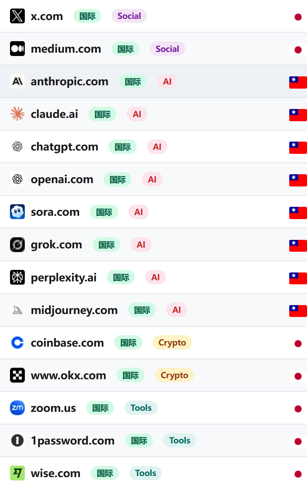

# 🚀 Mihomo / Clash Meta 高能全维分流配置

<p align="center">
  
  
  
</p>

一个针对 **高阶开发者与多AI工具链** 深度调优的 Mihomo (Clash Meta) 核心配置文件。偏向**极端稳定、结构解耦、低维护成本**，完美适配 TUN 模式与全端口嗅探。

---

## ✨ 配置核心亮点

### 🗺️ 精准地域策略组
内置精细化的全球节点空间划分，采用**显式手动选择组**与**后台隐式延迟测速组（url-test）**动态联动机制：

| 地区标签 | 后台自动测速组 | 覆盖与核心适用场景 |
| :--- | :--- | :--- |
| 🇭🇰 **香港** | `香港-自动选择` | 港区低延迟、高吞吐全服务加速 |
| 🇨🇳 **台湾省** | `台湾-自动选择` | 台湾省专属节点，完美解锁巴哈姆特动画疯 |
| 🇯🇵 **日本** | `日本-自动选择` | 日区原生落地、Niconico 及主流流媒体 |
| 🇰🇷 **韩国** | `韩国-自动选择` | 韩区特定游戏、高带宽落地服务 |
| 🇸🇬 **新加坡** | `新加坡-自动选择` | 狮城低延迟、高并发国际大厂服务 |
| 🇺🇸 **美国** | `美国-自动选择` | 美区全服务兼容，兜底 AI 与海外本土服务 |
| 🌍 **其他地区** | `其他地区-自动选择` | 自动过滤主流六区后的冷门/欧洲节点 |
| 🔓 **解锁节点** | `解锁节点-自动选择` | 提取原生、家宽、流媒体及大模型专用解锁节点 |

---

### 🧠 顶配 AI 服务专项优化
针对当前主流大模型及开发者生态进行了**全包围式域名与规则覆盖**。流量全量并入 `人工智能` 专用策略组，规避跳 IP 导致的锁区风险：
* 💬 **核心对话:** OpenAI (ChatGPT) / Claude.ai
* 🛠️ **开发者基础设施:** OpenRouter.ai / Devv.ai
* 🎨 **前沿创意生产:** Midjourney / xAI (Grok)

---

### 📱 常用服务独立解耦
针对日常高频使用的海内外主流服务配置了独立策略组，支持一键在 UI 界面快速切换出口出口：
> 🧩 `人工智能` · `Google全家桶` · `YouTube` · `TikTok` · `巴哈姆特` · `哔哩哔哩` · `NETFLIX` · `Spotify` · `Niconico` · `其他`

<br>

<details>
<summary>📊 <b>点击展开查看路由规则与策略分流效果图</b></summary>
<br>
<p align="center">
  
</p>
</details>

---

### 🔒 现代化 DNS 架构
> 采用 **Fake-IP 模式** + **纯大厂 DoH 异步解析** + **策略路由拦截**
* **Respect-Rules:** 核心解析逻辑强遵守规则集，彻底终结冷启动流量抢跑。
* **分流无缝映射:** 引入 `chinaDNS` 与 `foreignDNS` 统一锚点。国内域名由阿里/腾讯 DoH 秒级响应；国外域名及 Fake-IP 映射由 Cloudflare/Google 在代理网络内安全解析，杜绝 DNS 污染与泄漏。
* **缓存算法:** 采用高级 `arc` 缓存替换算法，兼顾命中率与内存开销。

---

### 🔍 高级 Sniffer 嗅探引擎
* 开启全协议全端端口嗅探：`HTTP` (80, 8080-8880) ｜ `TLS` (443, 8443) ｜ `QUIC` (443, 8443)
* 强制执行目标重定向（`override-destination: true`），还原真实请求生态。
* 精准配置 `skip-domain` 豁免名单（如米家云、Apple PUSH 及国内直连规则集），完美平衡动态嗅探与本地低延迟。

---

### 🔋 移动端与网络环境自适应调优
针对复杂多变的网络场景进行底层参数优化：
* **断连瞬时重置 (`reset-network-change`):** 在 Wi-Fi、蜂窝移动网络交替切换时瞬间重置网络栈，斩断残留死连接，网络过渡丝滑无感。
* **严格路由阻断:** 针对 Google 系服务执行高级 UDP 拦截（`REJECT-DROP` 443端口），强迫流量平滑回落至 TCP 轨道，大幅提升 YouTube 等服务的抗丢包稳定性。
* **严格进程寻址 (`find-process-mode: strict`):** 精准控制本地进程流量，确保网络沙箱环境的绝对安全。

---

## 📂 订阅与节点解耦管理

配置顶部引入了模块化 **YAML 声明锚点** 机制，实现了订阅源（Proxy Providers）与策略组的彻底解耦。你只需在顶层追加或修改订阅链接，策略组即可实现自动化无缝动态加载：

```yaml
proxy-providers:
  P1:
    <<: *p
    url: "填入订阅"     # 订阅1
    override:
      additional-prefix: "[P1]"

  P2:
    <<: *p
    url: "填入订阅"     # 订阅2
    override:
      additional-prefix: "[P2]"

```

*💡 彻底告别长篇大论、频繁更新的传统节点列表。通过 Provider 统一托管，后端自动完成 24 小时高级健康检查与并发测速。*

---

## 🎯 核心设计设计观

本配置的底层进化逻辑是：**稳定 > 清晰 > 极致自动化**。
不追求臃肿无用的千万条黑名单规则，而是专注于为以下日常硬核场景提供高品质网络支撑：

* 🌐 全局网页及学术文献高流畅检索
* 💻 GitHub 协作、AI 辅助编程（Devv/OpenRouter）与全栈工具链平稳运行
* 📺 国际流媒体（Netflix/巴哈姆特/YouTube 4K）超低延迟就绪

---

## ⚠️ 声明与须知

* 本仓库为个人自用配置共享，**不提供任何节点、不提供任何机场订阅服务**。
* 使用前请自行在 `proxy-providers` 节点填写个人的有效订阅。
* 路由分流规则带有强烈的个人开发者使用习惯，可根据具体业务场景自行调整 `nameserver-policy` 与 `rules`。

---

## 📜 License

Configured under learning and communication purposes. All rights reserved.

